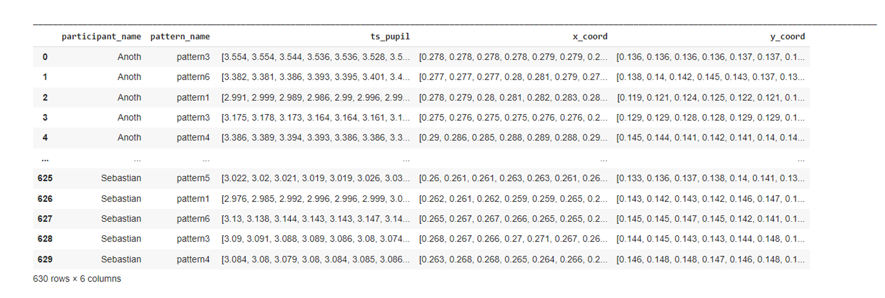
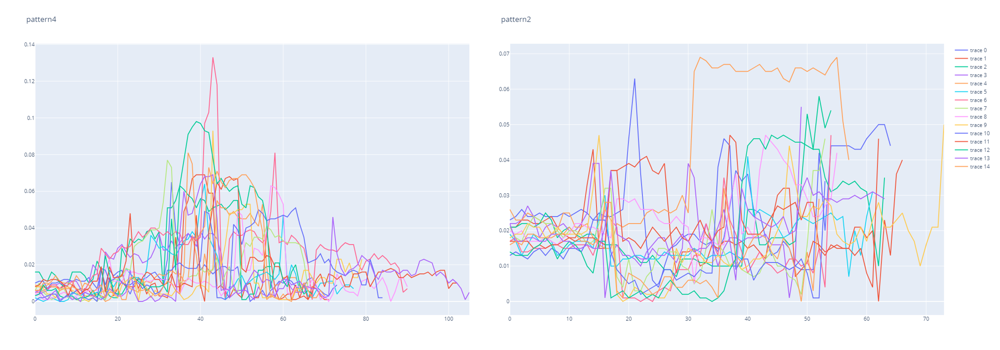
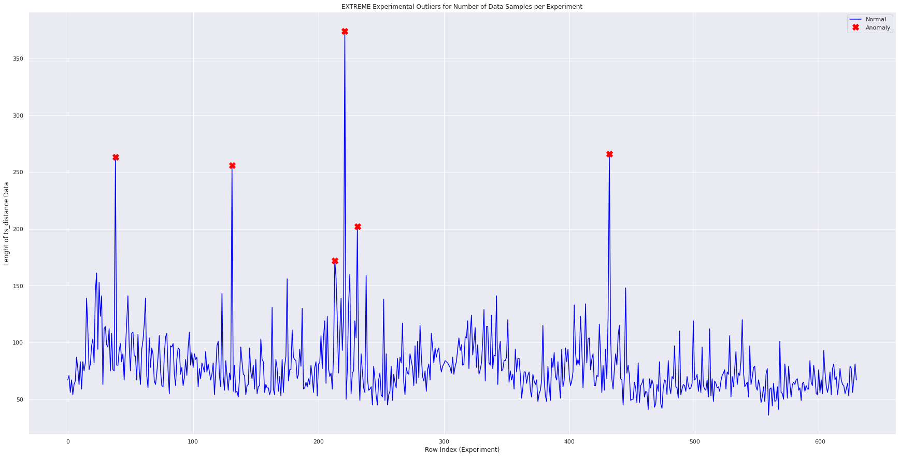
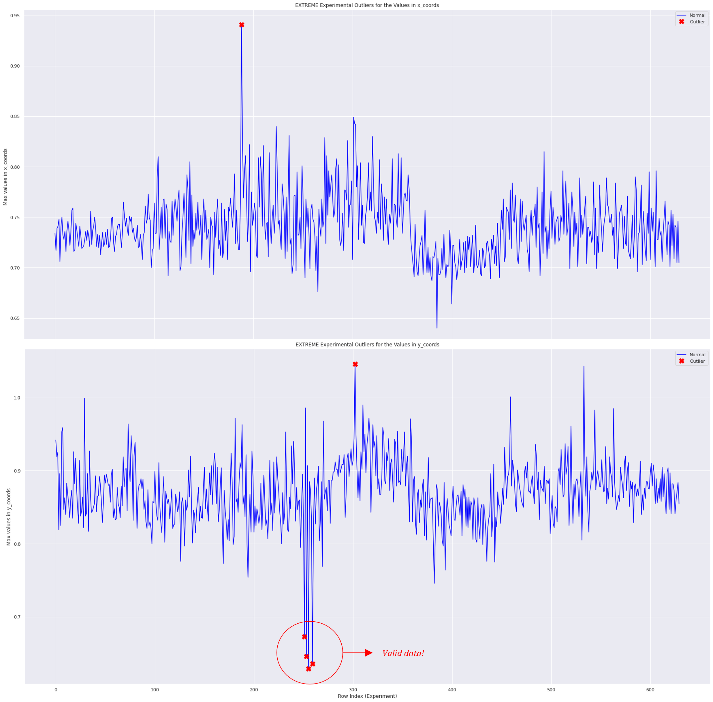
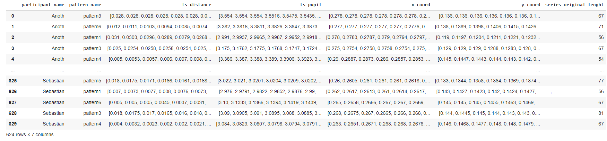
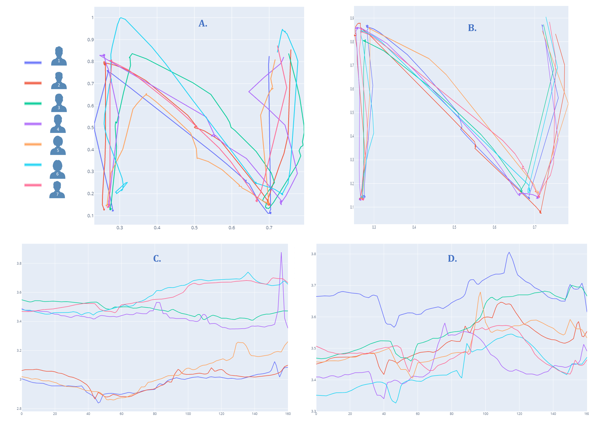
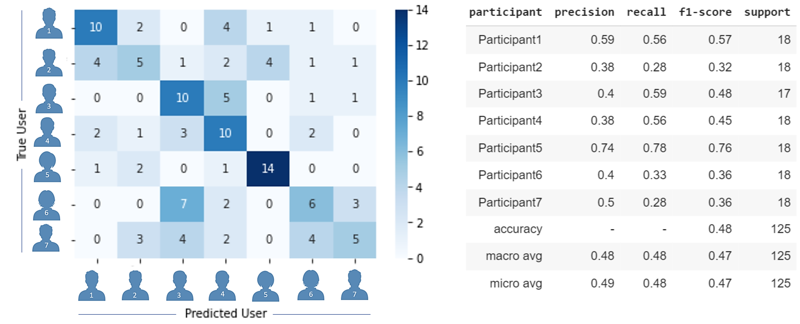
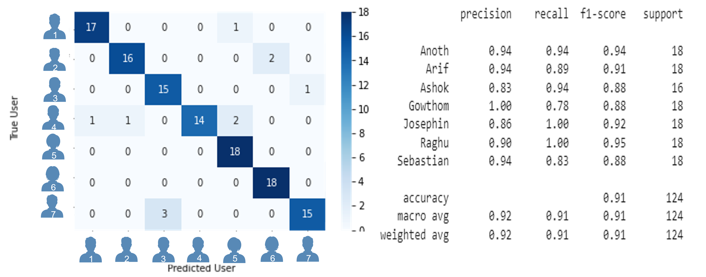
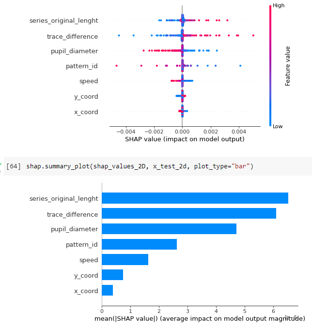
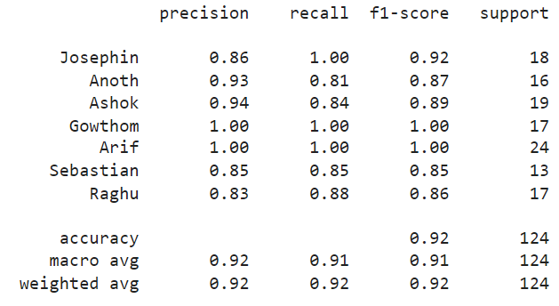

<h1>
 <p align="center">
  
</p>
 </h1>

<h4 align="center">Multivariate Time Series Classification for Eye Tracking Data</h4>

<p align="center">
 <a href="https://www.python.org/downloads/release/python-370/">
      
  </a>
 <a href="https://saythanks.io/to/lavmlk20201">
      
  </a>
 <a href="https://www.buymeacoffee.com/lavmlk2020B" target="_blank">
  </a>
</p>
 
The purpose of this repository is to provide the guidelines and a framework for time-series exploration and classification using eye-tracking data: **gaze shift** and **pupil diameter changes**. Even though the presented results are particular to the experimental setup, the pipeline was designed with scalability to other multivariate time-series classification tasks and other datasets. 

<p align="center">
  
</p>
<p align="center">
  <sub>source: https://www.tobii.com/group/about/this-is-eye-tracking/
  </p>
 
The task:
<p align="center">
<i><b>"To create a system capable of classifying users by finding an "eye-signature" in eye-tracking data".</b></i>
</p>

The data collection experiment: 
<p align="center">
<i><b>"Each participant will have to draw each of the 6 patterns 15 times with their eyes movement (gaze)".</b></i>
</p>

The 6 patterns are composed by 3 lines each. The form shapes such as 'Z', 'N', 'U'. If Such a system could be used for security applications for instance. The "eye-signature" would be the PIN to identify a person and grant access.

<p align="center">
  
</p>


### Overview: Pipeline description for classifying time series data
<sup>source: [IBM/what-is-time-series-classification](https://developer.ibm.com/learningpaths/get-started-time-series-classification-api/what-is-time-series-classification/)</sup>

## Requirements
Python version 3.7 or superior is strongly recommended. The requirements can be found inside `requirements.txt` and can be install running the command:
 
```{python}
!pip install --quiet -r requirements.txt
```

## How to use this repository?

The most stable pipelines for both exploring the data and building | training the model are found under the [notebooks](./notebooks/): [Hierachical Multivariate TimeSeries Classification](./notebooks/Hierachical_Multivariate_TimeSeries_Classification.ipynb) and [Time Series Exploratoy Data Analysis](./notebooks/Time_Series_EDA.ipynb). Some sample data can be found inside the `.data` folder and the original plots of the data inside `.media`. The folowing is a short description of each of the `*.py` files inside this repository:

- `aggregator.py`: Every single experiment's output signals for a single user drawing one pattern is originally stored on a separate `*.txt` file.  This script reads and aggregates each single file inside a parcipant's data-folder into a single file with the structure:

```{python}
 [['pattern_name', List(time_series)]]
 ```

This is done for both the information about `ts_distance` and `ts_pupil`.
  
- `dataset.py`: dataset construction options for several classifier types...
  
- `preprocessing.py`: preprocessing...
  
- `feature_engineering.py`: feature_engineering...

- `classifier.py`: This script contains the general pipeline for reading the data, transforming it, fitting a ML model against it, and evaluating its performance.

#### Example execution
- Run `aggregator.py` and store data in .data
- Run `classifier.py by` selecting the dataset, the classifier_type, the model and dataset and the hyperparameters configuration.
- todo: `evaluate.py`

## Exploratory Data Analysis (EDA)
In total, 30 people participated in the test (data collection) but for the sake of cleaner visualizations, the notebooks and the plots that are shown here are using only data of 7 participants. The classifications reports and other outputs are for models that were trained using the data of these 6 participants as well.
 
Originally, the data is composed by time-series gaze-shift and pupil-diameter readings which are the output of the eye-tracking device during the experiments. The data is presented with float resolution of 3 decimals as an approximation and a hyperparameter. The data with *float_resolution = 3*:


 
One important part of analysing the data is to consider adding more features to the data so is more rich. More features in general means that the algorithm would have more information to find a patterns assosiated with the target label, which is the participant_name in our case; however, some features could be misleading for the classifier forcing to fit into noise and making it hardly optimal predicting the label of unseen data.
 
In this case, the difference between the gaze-shift or eye-movement drawing a pattern and the ideal pattern description is added as an extra feature and called ts_distance. The details of how this metric is calculated can be found in the notebook called `DistanceAnalysis.ipynb`. The following plots show all the ts_distance calculations for participant5 + pattern4 and participant7 + pattern2:
 

 
Here we can clearly see that the experiments present variability in lenght and in value of the readings | calculations. Some experiments can be abnomaly long or posses values that are absurdly high. An outlier is a data point that lies outside the overall pattern in a distribution. These **outliers** of the data should be detected and removed from the data that is going to be fed to a classifier. Consequently, another feature related to the speed in which a parcipant succesfully draws a pattern is added to the data. This feature is called the series_original_lenght and it is integer number of data points taken for each experiment: the lower the number of data points, the faster the participant for that run. One kind of ouliers is then, the experiments in which a participant takes too long performing an attempt of drawing a specific pattern.
 
One very simple statistical method to detect outliers is [the interquartile range rule](https://youtu.be/FRlTh5HQORA). The interquartile range shows how the data is spread about the median and it's calculated by substracting the third and the first quatiles -> `IQR = Q3 - Q1`, where the third and first quartiles represent the number from which 75% and 25% of our data falls below. The following plot shows the extreme outliers in red for the lenghts of the time-series for each experiment after purging the data from zero values (blinking values in pupil diameter readings):
 
<p align="center">
  
</p>
 
 Another kind of information that could be useful to detect outlier are the max values for the distance metric and the pupil diameter readings. The following plots show the outliers' indices in x and y coordinates of the gaze-movement.
 
 <p align="center">
  
</p>
 
 The dataframe after normalizing all the data by lenght (all experiments stretched to the max lenght after outlier removal) and with the additional features is then:
 


The following are some aditional plots which are pretty useful to get insights about the data and clean it better. They contain all xy readings for a specific participant and an specific pattern ("N": pattern3) and the comparisson between partcipants for xy and pupil-diameter information for the third attempt of "N" pattern. The pupil time-series data has been normalized by lenght only, making all series the same size as the maximium series -> 161 data points. The pattern plot figures are inverted under the x-axis for simplicity of analysis.

<p align="center">
  
</p>

Plots **A** and **C** are respectively the XY coordinates and pupil diameter readings for 7 participants while their third attempt of pattern 3 (N).
Plots **B** and **D** are respectively the XY coordinates and pupil diameter readings for JUST ONE of the participants while their first 7 attempts of pattern 3 (N).
Some patterns of the data are already visible when visualizing the data like this. The plots for just one participant are more "uniform" and don't present as much variability as the plots that are comparing participants to each other.

## Algorithms Overview
The following are the most common approaches for time-series classification. In **bold**: currently available models.
 - Distance-based approaches
 - Shapelet
 - Model Ensembles: Desicion Trees and Binary Classifiers
 - Dictionary approaches
 - Interval-based approaches
 - **Deep Learning**: LSTM (implemented), CNN_Rocket (implemented)
 - 
<sup>minirocket source: https://github.com/angus924/minirocket</sup>

## Fine-Tuning
### Hyperparameters
A hyperparameter is a parameter whose value is used to control the learning process. It can be though as configuration variables. Your model parameters are optimized (you could say "tuned") by the training process: you run data through the operations of the model, compare the resulting prediction with the actual value for each data instance, evaluate the accuracy, and adjust until you find the best values. By contrast, hyperparameters are tuned by running your whole training job, looking at the aggregate accuracy, and adjusting. The values of other parameters are learned (like the neural network weights). Hyperparameter optimization or tuning is the problem of choosing a set of optimal hyperparameters for a learning algorithm.

<sup>source: [Google/hyperparameter-tuning-overview](https://cloud.google.com/ai-platform/training/docs/hyperparameter-tuning-overview)</sup>

#### For Getting the Data Ready (all models)
- Seed Value: for any random process (sampling and weights initialization)
- Normalize by Value: bool: [True, False]
- Data Splits: work only with latest 5 attempts for each participant or work only with the 5 cleanest attempts
- Data Cleaning: outliers and preprocessing
- Feature Selection: Dimensionality Reduction and trained-model feature importance.

#### For Neural Networks
- Number of Hidden Layers
- Number of Hidden Units (nodes)
- Regularization
- Batch Size
- Learning Rate
- Activation Functions
- Weights Initialization
- EarlyStopping and Checkpoints

<sub>additional link: [check this complete guide for neural-networks design](https://hagan.okstate.edu/NNDesign.pdf)</sub>

<sup>additional link: [batch_size and learning_rate can be auto-tuned with the Tuner class of PyTorch Lightning](https://pytorch-lightning.readthedocs.io/en/stable/api/pytorch_lightning.tuner.tuning.Tuner.html)</sup>

## Evaluation

### LSTM

#### Confusion Matrix

`31.08.2022:` This LSTM model was trained for 1200 iterations, using aproximatelly 1.3 million parameters and is *pattern agnostic*. This is just one trial without doing hyperparameter tuning and without value normalization of the time-series data. The training procedure was done considering all posible features except the velocity. The classifier shows good signs of learning. A binary classifier for each participant is also posible, counting on a small training time, they could be ensembled their predictions aggregated.

<p align="center">
  
</p>

---

`28.09.2022:` Model trained for 900 iterations, using approximatelly 900K parameters and is *pattern agnostic*. The model performance has improved due to standarization by value and outlier removal. All features were considered including the speed. This model is smaller but the data is richer and with more pre-processing | cleaning. The training procedure has an EarlyStopping criteria that will conclude the training once the validation accuracy does not increase for over the last 500 iterations of training data. Further fine-tuning is possible and more data and extra pre-processing procedures are available. The analysis of the features importance for the model's predictions against test data can be found on the next section. 

<p align="center">
  
</p>

#### Feature Importance and Model's Predictions Explaination
The following plots show each of the features impact on the model's predictions against test data (unseen samples). The model was trained for multiclass classification with 6 participants as the labels. The pattern_id is an additional feature, wether in int form or in one-hot-encoding

<p align="center">
  
</p>

This is how the model uses the featural information to produce its outout, and represents the weight or importance of each feature for a single test sample prediction. The ouput values are in the form of `logits`. The spaced-line corresponds to the decision path for the final model decision (participants_id)

<p align="center">
  
</p>

The model's output can be understood as the final state the model reaches where the final decision is taken. That's the reason why all the label paths coverge to the same final state. In this moment the model checks the values of each output neuron (one neuron per participant) and get's the maximum value between all of them. The values of the neurons are not well represented in the graph, so for interpretation the values of the x-axis are better when ignored.

### CNN: Rocket

#### Confusion Matrix

`10.09.2022:`

<p align="center">
  
</p>

<p align="center">
  
</p>


## License

The [GNU General Public License](https://github.com/LaverdeS/Multivariate-Time-Series-Classification/blob/main/LICENSE): Everyone is permitted to copy and distribute verbatim copies of this license document, but changing it is not allowed. Note that free here refers to freedom but not free of price. Doing this repository took several hours. This time and effort is with the spirit of providing the research community with beneficial tools for their eye-tracking projects. Everyone is welcome to contribute. If you find this repository useful and want to suppot the author, you can [Buy Me a Coffe!](https://www.buymeacoffee.com/assets/img/custom_images/orange_img.png)

## Buy Me a Coffee
<p>
  </a>
 <a href="https://www.buymeacoffee.com/lavmlk2020B" target="_blank">
  </a>
</p>
