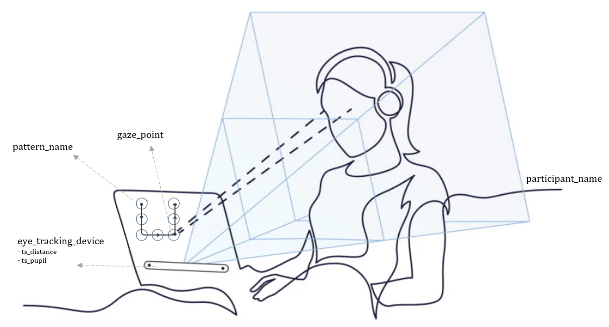

<h1>
 <p align="center">
  
</p>
 </h1>

<h4 align="center">Multivariate Time Series Classification for Gaze Tracking Data</h4>

<p align="center">
 <a href="https://www.python.org/downloads/release/python-370/">
      
  </a>
 <a href="https://saythanks.io/to/lavmlk20201">
      
  </a>
 <a href="https://www.buymeacoffee.com/lavmlk2020B" target="_blank">
  </a>
</p>
 
- Explore the classification of `participant_name` by the means of time-series gaze `ts_distance` and pupil dilation `ts_pupil` information.
- The dataset was collected from users asked to draw 3-segments patterns with their eyes. (the details for the data-collection are not part of this repository).

<p align="center">
  
</p>
<p align="center">
  <sub>source: https://www.tobii.com/group/about/this-is-eye-tracking/
  </p>
  
### Overview: Pipeline description for classifying time series data
<sup>source: [IBM/what-is-time-series-classification](https://developer.ibm.com/learningpaths/get-started-time-series-classification-api/what-is-time-series-classification/)
  
<sup>For time series classification, the data set is typically split into three sets of data: the **training set**, the holdout or **validation set**, and the **test set**. The **training set** is used initially to set the parameters of the algorithms that are chosen to attack the problem. The **validation set** is then used to choose which algorithm performs the best. Finally, the chosen algorithm is used to score the **test set** and determine the quality of the classifier. Time series data is temporally ordered and sequential, this is important when deciding on the classification algorithm.
  
<sup>Often with real-world data collection, the length of the samples in a time series is different. This can be problematic for some classifiers such as *dynamic time warping* when a warping window smaller than the difference in sample length is used, or *nearest neighbor* using *Euclidian distance*. In the case of **varying length samples**, multiple techniques are available for scaling the data to equal lengths, adding low-noise prefixes or suffixes to the shorter samples, for example, while at the same time preserving the class of the data sample.

<sup>In addition to unequal sample lengths, **data-gaps** are not handled well by most time series classification algorithms. Null values or not-a-number (NaN) values should be replaced manually in the data with a value that is based on linear interpolation from the immediately adjacent values.

<sup>Finally, it might be advantageous to identify new features that can be added to the data set. These features should be generated based on domain knowledge of the problem together with the objective of the classification work. Such **feature engineering** could be in the form of data correlations, increasing or decreasing data trends, rolling window mean or weighted average, or the inclusion of exogenous data and features not present in the original data set.

<sup>The final step of the process is to use the various models that are created to score the validation data set to **choose the best model**, to tune it, and to use against the test data.

<sup>Following the model building phase, a time series classifier is then put to work in analyzing or classifying a time series sequence that it has not been trained on. This scoring phase can be done in real time on streaming data or it can be done in a batch phase against a fully collected data set. In either case, the **quality and accuracy of the model** is determined by the type and quality of the training data and how closely it matches the data being tested. No single algorithm always creates the best results, which is to say that there is still a lot of data science tradecraft involved in formulating a time series classifier.

<sup>The statistical metrics of precision, recall, and accuracy have been traditionally used to gauge the quality of a classifier’s performance. In some cases, such as healthcare, false negative results can be deadly, so the quality of a classifier in such environments is often measured by using an **ROC curve**. The ROC curve for the classifier is generated by plotting the true positive rate (TPR or **sensitivity**) against the false positive rate (FPR or **specificity**). The quality of the classifier using this method is the area under the ROC curve or the AUC (area under the ROC curve). A measure of 1.0 for AUC signifies perfect classification, while a value of 0.5 means that the classifier cannot differentiate at all. Depending on the application, any or all of the previous quality metrics can be useful.</sup></sup></sup></sup></sup></sup></sup>

## Requirements
Python version 3.7 or superior is strongly recommended. The requirements can be found inside `requirements.txt` and can be install running the command:

```!pip install --quiet -r requirement.txt```

## How to use this repository?
Some sample data can be found inside the `.data` folder and the original plots of the data inside `.media`. The folowing is a short description of each of the `*.py` files inside this repository:

- `aggregator.py`: Every single experiment's output signals for a single user drawing one pattern is originally stored on a separate `*.txt` file.  This script reads and aggregates each single file inside a parcipant's data-folder into a single file with the structure:

```[['pattern_name', List(time_series)]]```

This is done for both the information about `ts_distance` and `ts_pupil`.
  
- `dataset.py`: dataset construction options for several classifier types...
  
- `preprocessing.py`: preprocessing...
  
- `feature_engineering.py`: feature_engineering...

- `classifier.py`: This script contains the general pipeline for reading the data, transforming it, fitting a ML model against it, and evaluating its performance.

#### Example execution
- Run `aggregator.py` and store data in .data
- Run `classifier.py by` selecting the dataset, the classifier_type, the model and dataset and the hyperparameters configuration.
- todo: `evaluate.py`

## Exploratory Data Analysis (EDA)
Implementing...

## Algorithms Overview
The following are the most common approaches for time-series classification. In **bold**: currently available models.
 - Distance-based approaches
 - Shapelet
 - Model Ensembles
 - Dictionary approaches
 - Interval-based approaches
 - **Deep Learning**: LSTM, CNN_Rocket
